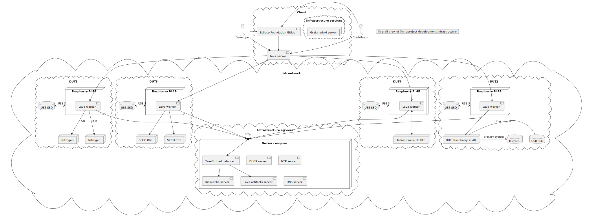
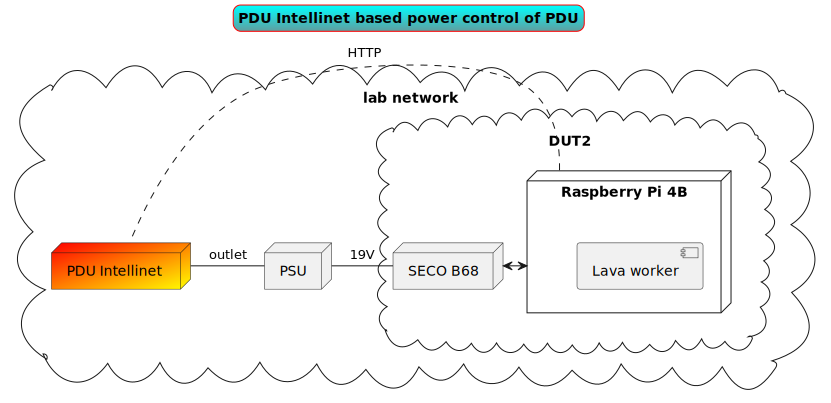
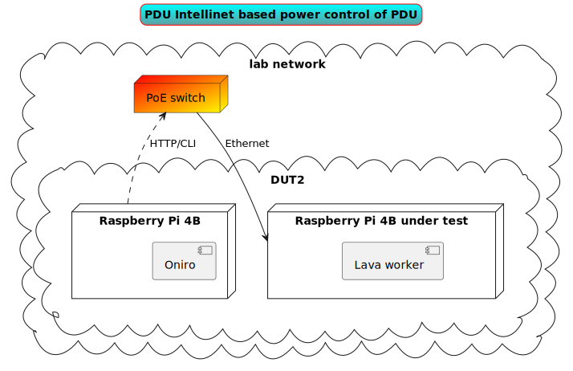
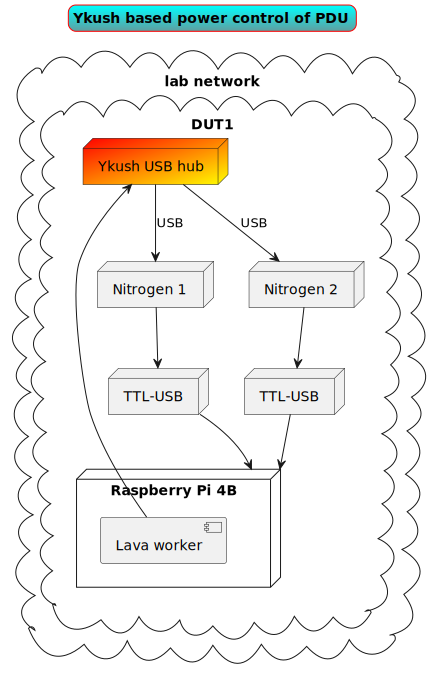
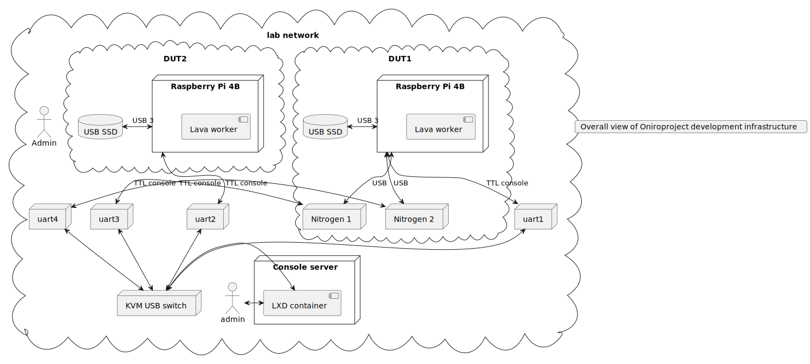

<!--
SPDX-FileCopyrightText: Huawei Inc.

SPDX-License-Identifier: CC-BY-4.0
-->
# Hardware Lab as a Service blueprint

## Network and services diagrams
The overall view of development test bench: 

The environment is under constant development and it is evolving along with new hardware coming, but there is standard set of connections and rules.

Every DUT power supply is controlled via via lava worker to restart device when flashing is complete. Power controll is realised in one of three ways, depending on the device:
- Via PDU Intellinet 
- Via PoE switch 
- Via Ykush Yepkit USB Switchable Hub 

Moreover, every controlling host and hardware susceptible to instability, has its power supply controlled by power distribution unit (PDU) capable of power cycling each socket.

- Every device TTL console is connected via TTL to USB interface to ICY box kvm switch, which in turn is connected to console server and LXD container available to Developer.

## Lava workers configurations
Not all types of devices are the same, and depending on available and required peripherals the wiring and lava test [configuration](https://git.ostc-eu.org/OSTC/infrastructure/lava/lava-test-definitions) differ.

## Contributing

See the `CONTRIBUTING.md` file.

## License

The license of this repository is as follows:

* Documentation text is under `CC-BY-4.0` license
* 3D printed designs of shelves and trays under `CC-BY-NC-SA-4.0` license
* Scripts, tools, and so on, are under `Apache-2.0` license

